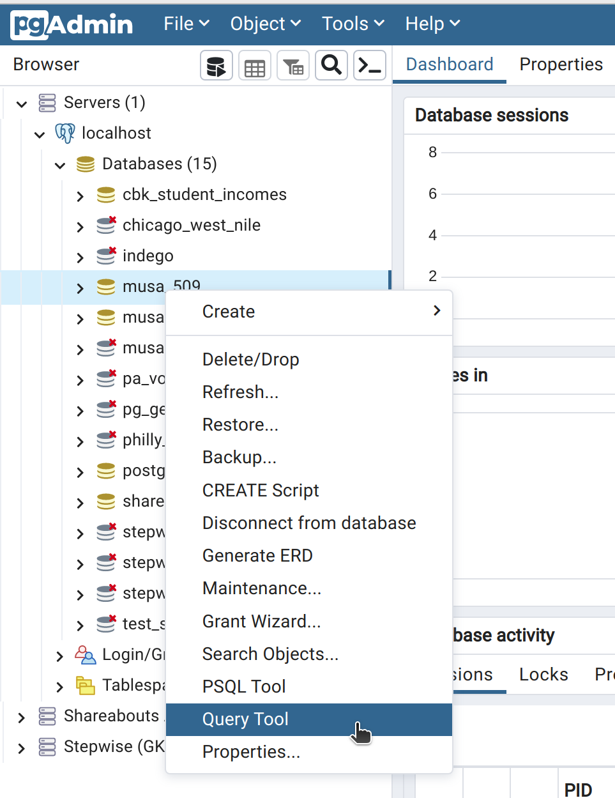
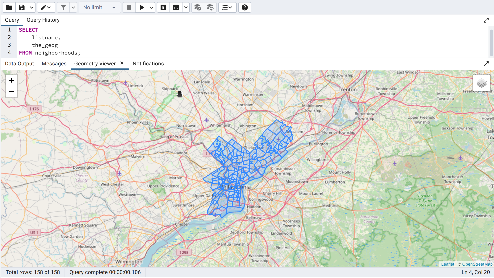

# Install QGIS

I recommend installing QGIS first, because:
1.  we'll use it later, and
2.  PostGIS and QGIS share many of the same dependencies, so if QGIS is installed correctly, you'll have an easier time installing PostGIS (especially if you're on Windows).

# Install PostgreSQL

You can find a set of installation instruction for your platform at https://www.postgresql.org/download/ (but check out the _Getting Started_ video for your operating system below first). Pay close attention to the port that you configure PostgreSQL to work on during installation -- `5432` is the default, but there are cases where that may not be the port used.

Make sure you install PostGIS along with PostgreSQL.

Helpful links:
- [postgis.net - Gettings Started - Installing PostGIS](https://postgis.net/documentation/getting_started/#installing-postgis)
- [Getting Started with PostGIS in QGIS on Windows (🎥)](https://video.osgeo.org/w/bRrjXpTBKLWN17LNHj7LXq)
- [Getting Started with PostGIS in QGIS on macOS (🎥)](https://video.osgeo.org/w/pxcBCc4oHhAZvUi9NdWxXf)

# Configure PGAdmin

To create a database you can use PGAdmin. First, register your local PostgreSQL server:


On the **General** tab, choose a name for the server as it will show up in the list on the left side of the window. Configure the **Connection** settings for how PGAdmin will connect to your database server. If you installed PostgreSQL correctly, then:
* The **host** will probably be `localhost`
* The **port** will probably be `5432`
* Leave the **maintenance database** as `postgres`
* The **username** and **password** will depend on what you set them to when you installed PostgreSQL.

You should be able to ignore the rest of the settings and click **Save**.


# Make sure it worked!

## 1. Create a new database in your PostgreSQL server.

Give the database some name (it doesn't matter what, as long as it's a valid SQL "identifier").


## 2. Enable PostGIS in the database.

You must do this once for each PostgreSQL database where you want to use geometric or geographic data types that come with PostGIS. Open a query editor for the database you just created:


In your query editor, enter the following SQL command and press the play (▶️) button.

```sql
CREATE EXTENSION postgis;
```

In the output you should see something like:

```
CREATE EXTENSION

Query returned successfully in 877 msec.
```

## 3. Load some data into your database.

Let's use the Philadelphia Neighborhoods dataset from Azavea to continue with our tests.

1.  Clone the https://github.com/azavea/geo-data repository to your computer.
2.  Open the folder for the repository in a terminal.
3.  Run the `ogr2ogr` tool (which should have been installed with PostGIS) using the command below, inserting your database connection information in the appropriate places:

    _For Mac/Linux:_
    ```sh
    ogr2ogr \
      -f "PostgreSQL" \
      -nln "neighborhoods" \
      -lco "OVERWRITE=yes" \
      -lco "GEOM_TYPE=geography" \
      -lco "GEOMETRY_NAME=the_geog" \
      PG:"host=localhost port=5432 dbname=... user=... password=..." \
      "Neighborhoods_Philadelphia/Neighborhoods_Philadelphia.geojson"
    ```

    _For Windows Powershell:_
    ```sh
    ogr2ogr `
      -f "PostgreSQL" `
      -nln "neighborhoods" `
      -lco "OVERWRITE=yes" `
      -lco "GEOM_TYPE=geography" `
      -lco "GEOMETRY_NAME=the_geog" `
      PG:"host=... port=... dbname=... user=... password=..." `
      "Neighborhoods_Philadelphia\\Neighborhoods_Philadelphia.geojson"
    ```

    For example, on my computer I ran:

    ```sh
    ogr2ogr \
      -f "PostgreSQL" \
      -nln "neighborhoods" \
      -lco "OVERWRITE=yes" \
      -lco "GEOM_TYPE=geography" \
      -lco "GEOMETRY_NAME=the_geog" \
      PG:"host=localhost port=5432 dbname=throwaway user=postgres password=postgres" \
      "Neighborhoods_Philadelphia/Neighborhoods_Philadelphia.geojson"
    ```

    If the command was successful you shouldn't see any output; you will just be returned to a new command prompt.

    The `ogr2ogr` command converts some spatial data from one format to another (in this case from GeoJSON to PostGIS). The `-f` value specifies the output format. The `-nln` value specifies the name of the table in the database. The `-lco` lines represent other options you can specify (such as the type of geometry and the name of the geometry field). The line that starts with `PG:` is for the output location, and the next line is for the input location.

    In the lecture for next week we'll go over some other ways to load data into PostgreSQL.

## 4. Query the data.

Back in PG Admin open a new query editor and run the following SQL:

```sql
SELECT
    listname,
    the_geog
FROM neighborhoods;
```

If successful, you should see something like this:


Click on the map icon next to the header of the `the_geog` column. You should see a map that looks something like this:

