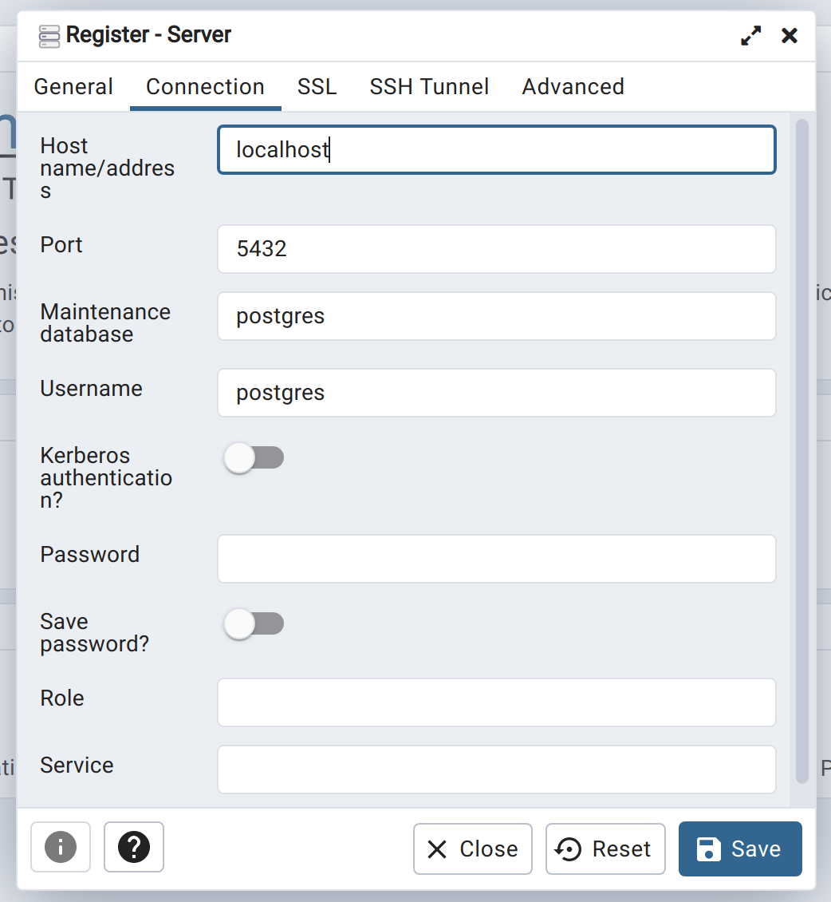
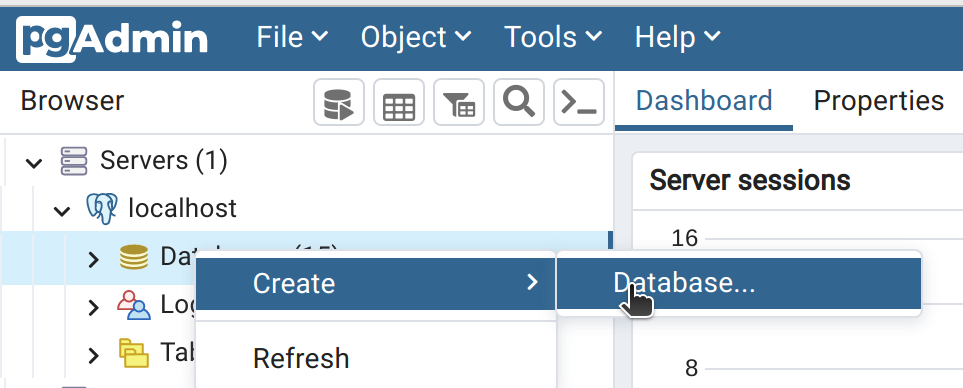

# Install QGIS

I recommend you use the long-term release (LTR) version. Check below for instructions related to your OS.

## Windows

Use OSGeo4W (https://www.osgeo.org/projects/osgeo4w/)

- Choose the **Express Desktop Install** option
- Install **QGIS**, **GDAL**, and **GRASS GIS**
- The default installation folder is `C:\OSGeo4W64`. If you install it anywhere else, please remember the path.

## Mac

Use the official QGIS installer (https://www.qgis.org/download/)

# Install PostgreSQL

You can find a set of installation instruction for your platform at https://www.postgresql.org/download/ (but check out the _Getting Started_ video for your operating system below first). Pay close attention to the port that you configure PostgreSQL to work on during installation -- `5432` is the default, but there are cases where that may not be the port used.

Helpful links:
- [postgis.net - Gettings Started - Installing PostGIS](https://postgis.net/documentation/getting_started/#installing-postgis)
- [Getting Started with PostGIS in QGIS on Windows (🎥)](https://video.osgeo.org/w/bRrjXpTBKLWN17LNHj7LXq)
- [Getting Started with PostGIS in QGIS on macOS (🎥)](https://video.osgeo.org/w/pxcBCc4oHhAZvUi9NdWxXf)

## Windows

Use the EDB installer (https://www.enterprisedb.com/downloads/postgres-postgresql-downloads). Make sure you install PostGIS along with PostgreSQL. Choose the latest version of PostGIS from the "Spatial Extensions" category.

## Mac

Use Postgres.app (https://postgresapp.com/). It's the easiest way to get PostgreSQL and PostGIS running on a Mac. It's great.

# Configure PGAdmin

To create a database you can use PGAdmin. First, register your local PostgreSQL server:


On the **General** tab, choose a name for the server as it will show up in the list on the left side of the window. Configure the **Connection** settings for how PGAdmin will connect to your database server. If you installed PostgreSQL correctly, then:
* The **host** will probably be `localhost`
* The **port** will probably be `5432`
* Leave the **maintenance database** as `postgres`
* The **username** and **password** will depend on what you set them to when you installed PostgreSQL.

You should be able to ignore the rest of the settings and click **Save**.



# Make sure it worked!

## 1. Create a new database in your PostgreSQL server.

Give the database some name (it doesn't matter what, as long as it's a valid SQL "identifier").


## 2. Enable PostGIS in the database.

You must do this once for each PostgreSQL database where you want to use geometric or geographic data types that come with PostGIS. Open a query editor for the database you just created:


In your query editor, enter the following SQL command and press the play (▶️) button.

```sql
CREATE EXTENSION postgis;
```

In the output you should see something like:

```
CREATE EXTENSION

Query returned successfully in 877 msec.
```

## 3. Load some data into your database.

We will use a tool called `ogr2ogr` to load some data into the database. Ogr2ogr is used to convert spatial layer data from one format into another. In this case, we'll be converting data from GeoJSON files into PostGIS tables.

> Before using the commands below, you'll need to ensure that the `ogr2ogr` command line tool is accessible. How will you know whether it is? Open up a terminal and type `ogr2ogr` and then press enter. If you see a message that says `FAILURE: No target datasource provided`, then you're good to go. If you see a message that says `command not found` or `not recognized as an internal or external command, operable program or batch file`, then there's more to do.
> 
> The `ogr2ogr` tool is part of the GDAL suite of tools, so you'll need to make them accessible by setting your `PATH` environment variable.
> 
> - ### Windows
> 
>   On Windows, you will have installed GDAL when you installed OSGeo4W. Follow the instructions at https://gisforthought.com/setting-up-your-gdal-and-ogr-environmental-variables/ to update your `Path` environment variable.
> 
> - ### Mac
> 
>   On Mac, you will have installed GDAL when you installed PostGIS (if you used the Postgres.app installer). Follow the instructions to **Configure your `$PATH`** at https://postgresapp.com/documentation/cli-tools.html.
>
> **_After your `PATH` is configured, you will have to close and restart all of your terminals and VS Code._**
>
> Continue with the instructions below after you have confirmed that `ogr2ogr` is accessible.

Let's use the Philadelphia Neighborhoods dataset from OpenDataPhilly to continue with our tests.

1.  Clone the https://github.com/opendataphilly/open-geo-data repository to your computer.
2.  Open the folder for the repository in a terminal.
3.  Run the `ogr2ogr` tool using the command below, inserting your database connection information in the appropriate places (i.e. in place of the `...` below):

    _For Mac/Linux:_
    ```sh
    ogr2ogr \
      -of "PostgreSQL" \
      -nln "neighborhoods" \
      -lco "OVERWRITE=yes" \
      -lco "GEOM_TYPE=geography" \
      -lco "GEOMETRY_NAME=geog" \
      PG:"host=localhost port=... dbname=... user=... password=..." \
      "philadelphia-neighborhoods/philadelphia-neighborhoods.geojson"
    ```

    _For Windows Powershell:_
    ```sh
    ogr2ogr `
      -of "PostgreSQL" `
      -nln "neighborhoods" `
      -lco "OVERWRITE=yes" `
      -lco "GEOM_TYPE=geography" `
      -lco "GEOMETRY_NAME=geog" `
      PG:"host=... port=... dbname=... user=... password=..." `
      "philadelphia-neighborhoods\\philadelphia-neighborhoods.geojson"
    ```

    The `ogr2ogr` command converts some spatial data from one format to another (in this case from GeoJSON to PostGIS). There are [_many_ options](https://gdal.org/en/stable/programs/ogr2ogr.html) you can use with `ogr2ogr`, but here are the ones we're using:
    - The `-of` value specifies the **o**utput **f**ormat.
    - The `-nln` value specifies the **n**ew **l**ayer **n**ame (i.e. the name of the new table in the database).
    - The `-lco` lines represent other **l**ayer **c**reation **o**ptions you can specify (e.g. the geometry type, or the name of the geometry field), which vary according to the output format.
    - The line that starts with `PG:` specifies the output location (in this case, a **P**ost**G**IS table).
    - The next line specifies the input location (in this case, a file on your computer). `ogr2ogr` will try to guess the input format, but you can also specify an `-if` option if you don't want it to guess.

    For example, on my computer I ran:

    ```sh
    ogr2ogr \
      -of "PostgreSQL" \
      -nln "neighborhoods" \
      -lco "OVERWRITE=yes" \
      -lco "GEOM_TYPE=geography" \
      -lco "GEOMETRY_NAME=geog" \
      PG:"host=localhost port=5436 dbname=week01 user=postgres password=postgres" \
      "philadelphia-neighborhoods/philadelphia-neighborhoods.geojson"
    ```

    If the command was successful you shouldn't see any output; you will just be returned to a new command prompt.

    In the lecture for next week we'll go over some other ways to load data into PostgreSQL.

## 4. Query the data in PG Admin.

Back in PG Admin open a new query editor and run the following SQL:

```sql
SELECT
    listname,
    geog
FROM neighborhoods;
```

If successful, you should see something like this:


Click on the map icon next to the header of the `geog` column. You should see a map that looks something like this:


Try filtering the neighborhoods for just those that are "mid-sized" with the following SQL (using my arbitrary cut-off values):

```sql
SELECT 
    listname,
    geog
FROM neighborhoods
WHERE shape_area > 3650000
  AND shape_area < 90000000;
```

## 5. Query the data in QGIS.

To start, you'll need to add a connection to your PostgreSQL database in QGIS. The videos linked above in the "Install PostgreSQL" section show how to do this.

After you have your connection, right click on your `neighborhoods` table and choose **Execute SQL..."**. Enter the SQL query from step 4 above and click **Execute**.

At the bottom of the window you should see **Load as new layer**. Open that section, choose the `listname` field as the column with unique values (so that QGIS can uniquely identify each feature), and choose `geog` as the geometry column. _Check the boxes next to those two options as well._

Click **Load Layer** to add a new layer based on the query data to your map.

> Note: If you don't see anything you may be zoomed out too far. Try going to **Edit > Select > Select All Features**, and then **View > Zoom to Selection**.